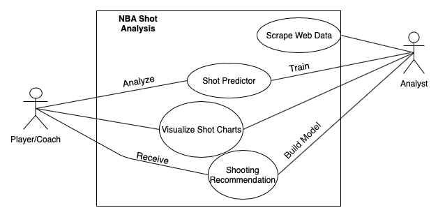

# NBA-Shot-Analysis

## Project Abstract
&nbsp;&nbsp;&nbsp;&nbsp;The goal of this repo is to build a classification machine learning model to predict whether an NBA shot will go in or not, given the shot distance, the FG% of the zone the shot is in, the Defensive Win Shares per 48mins, Defender Distance, Touch Time, and Shot Clock remaining.

&nbsp;&nbsp;&nbsp;&nbsp;In addition, this repo is creating a recommender system for player shooting frequency in the zones of a court. For instance, the recommender system compares your points per shot (PPS) in each zone with the league average. At the basic level, it recommends all zones where your PPS is greater than the league average, and discourages you from continuing to shoot in areas where your PPS is lower than the league average.

&nbsp;&nbsp;&nbsp;&nbsp;The next steps and future work of this project include optimizing the neural network and recommendation system. Also, the creator wants to use Dash and Flask to make the project accessible online. In this way, there is plenty of work to be done by students with all interests.

## Project Relevance
&nbsp;&nbsp;&nbsp;&nbsp;The Relevance of this project comes with Test-Driven Development, Debugging, and Code Profiling. This repo does not have tests written into it, so our contributions could start by adding tests to the already written code. Once that is in place, we can continue to develop the repo using TDD practices and enhancing the already-implemented features. These enhances include but are not limited to code profiling and optimizations, debugging hard-to-find bugs in the code, and improving accuracy of the machine learning models.

&nbsp;&nbsp;&nbsp;&nbsp;Another important skill this project teaches is reading, understanding, and debugging someone else's code. In the workplace, it is very common to need to read and understand other people's code; very little of your company's code will actually be written by you. By working on this project, we will all need to read and understand the already written code, and then work to debug, write tests, and enhance the code. This process will replicate very common tasks done in the workplace.

## Conceptual Design
&nbsp;&nbsp;&nbsp;&nbsp;My personal contribution would be to improve the Machine Learning models through a combination of methods. First, I would read into sports analytics literature and compare the current repo with work being done by other analysts. I plan to implement tests for the model to make sure it is running as planned, which also bolsters my skills as a Test-Driven Developer. I would then incorporate their methods into my own and work to improve the methods by changing features used in the network as well as the amount of layers and nodes in the net. By diligently working on this training, progress is sure to be made.

&nbsp;&nbsp;&nbsp;&nbsp;Because of the complexity and nature of machine learning models, the particular contribution I'm discussing could be done by just myself or the entire team. As a team, we could all contribute to the machine learning model(s); in fact, the creator of this repo has trained 6 different models. On the other hand, our team could split up the tasks; a subteam could work on the machine learning enhancements while others implement the Flask web interface. 

### Reference to the Project
https://github.com/slieb74/NBA-Shot-Analysis
